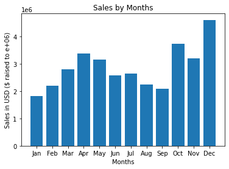
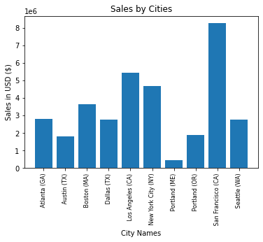
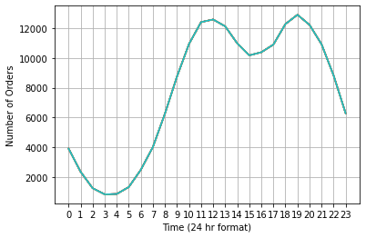
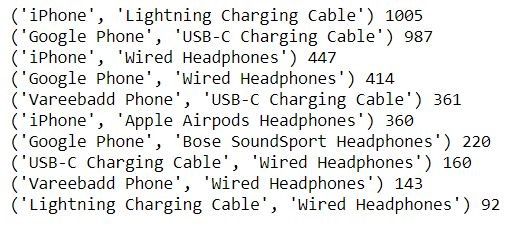
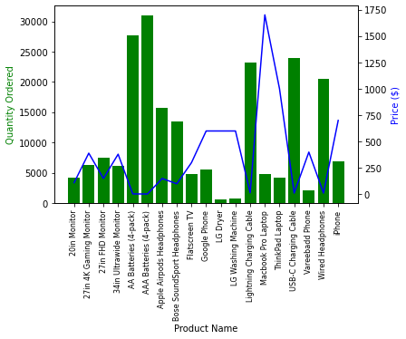

# Sales-Analysis

Sales analysis of an ***online electronics store***.   This project contains basic analysis of the dataset from an online electronic store in US and aims to answer some basic questions that may arise for the store manager/owner giving a much better insight about the store and how to increase the productivity. The dataset can be found in the ```Data``` Directory. The dataset is of the year 2019 which is monthly segregated. The combined dataset is in the  ```all_data.csv``` file. Step by step execution can be found in the '[Sales-Analysis.ipynb](https://github.com/smit-sms/Sales-Analysis/blob/main/Sales-Analysis.ipynb)' File.

## Main stages of this analysis are:

- Getting main info about data. (Top values, unique values, NaN amount, how orders are presented, etc.
- Cleaning data from NaN.
- Adding necessary info to perform analysis.
- Answering questions.
- Plotting graphical results.

## The following questions are analyzed and successfully answered:
**1. What was the best month for sales?**
<details><summary>Answer</summary>
	


</details>

**2. What city sold the most product?**
<details><summary>Answer</summary>



</details>

**3. What time should we display advertisements to maximize the likelihood of purchases?**
<details><summary>Answer</summary>



As per the chart, the advertisements should be displayed between 11am to 12pm and between 6pm to 8pm to maximize the likelihood of purchase.

</details>

**4. What products are most often sold together?**
<details><summary>Answer</summary>
	


The 2 most common products sold together are iPhone and Lightning Charging Cable.

</details>
	
**5. What product is sold the most?**
<details><summary>Answer</summary>



The AAA Batteries are the most sold product followed by AA Batteries with USB-C and Lightning Charging Cables coming close. Since these items are more cheaper than many other items there is a possibility of this being the reason for most selling of these items.

</details>

## License

This project is licensed under the MIT License - see the [LICENSE](https://github.com/smit-sms/Sales-Analysis/blob/main/LICENSE) file for details.
